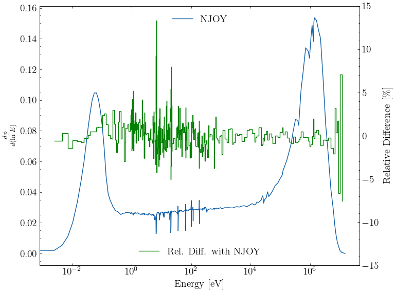
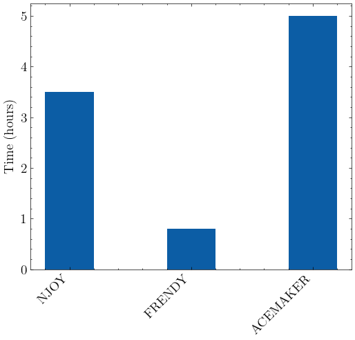

# triga-dataLibrary
This repository contains scripts for processing nuclear data using ACEMAKER, FRENDY, and NJOY.

## keff 
- 1.07745 (Experimental)
- 1.07838 +/-0.00012 (NJOY)
- 1.07829 +/-0.00013 (FRENDY)

## Neutron Flux ($\frac{d\phi}{d(\ln E)}$)

## Code Performance

FRENDY takes the least amount of time for data processing, followed by NJOY and then ACEMAKER.
